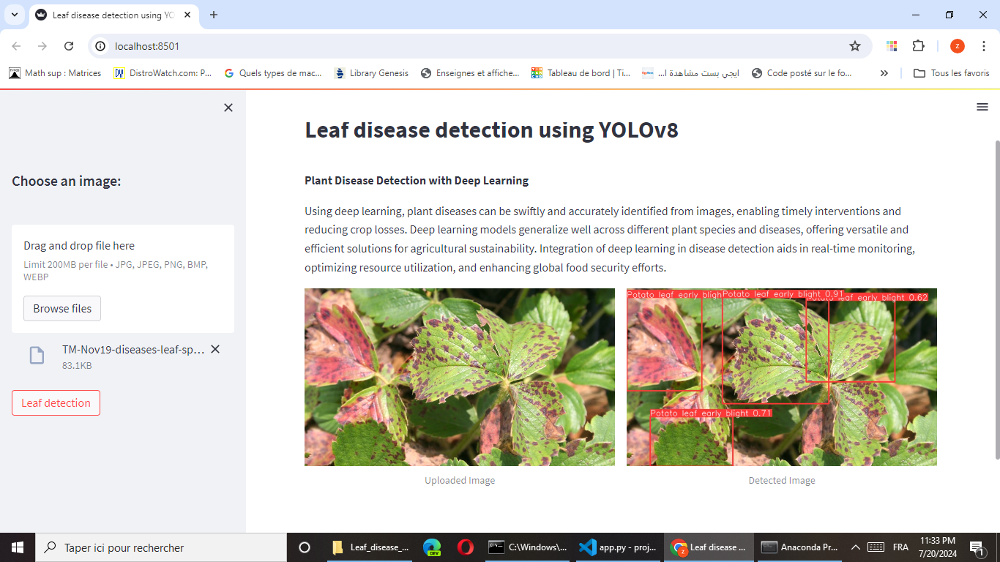

# Leaf Disease Detection Using YOLOv8

## Overview

This project involves training a leaf disease detection model using the YOLOv8 architecture. The model can be deployed via a Streamlit app for interactive use.

## Installation

1. **Install YOLOv8 Requirements**

   Ensure you have the necessary libraries and dependencies for training the YOLOv8 model.

2. **Install Streamlit**

   Streamlit is required to run the web application interface. Install it using pip:

   ```bash
   pip install streamlit



